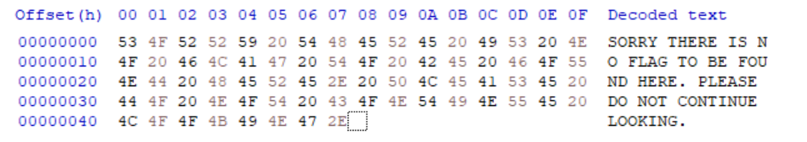
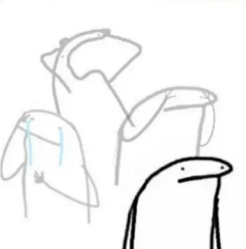
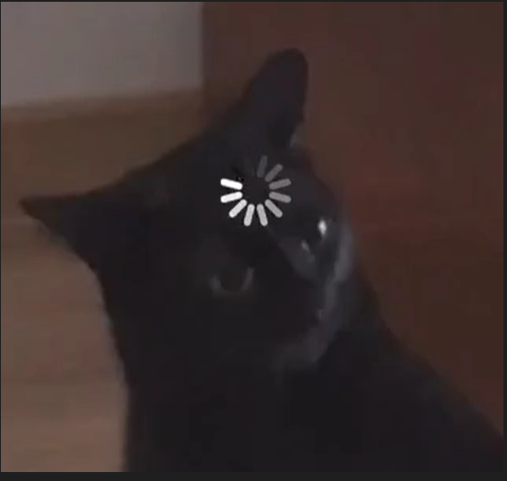
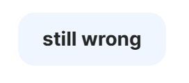

# Based-64

There was just one file given in the challenge `based64.txt`\
And it just had a bunch of base 64 coded texts...

#### And well ahem, as a professional decoder - I went straight to [decode.fr](https://www.dcode.fr/en)

It gave some amazing result:

```
St÷Ru'Yb�Tt�Eu%Eb�IU5 tãO2�FdÄAT� eBO2�BtT tcOU_N4C t�Eu%E2ä e�LtZAU?Er�Dtô 4ãOeG 40OTïTd�NuUEb�LtýO�°I�àG.
```

Yes too amazing gibberish that my mind could not comprehend and I had to turn to Chatgpt...\
It did decrypt and give me the answer:

```
SORRY THERE IS NO FLAG TO BE FOUND HERE. PLEASE DO NOT CONTINUE LOOKING.
```

I also tried HxD and ended up with the same answer.


Reiterated it through gpt and ended up with something like this: {Base64_has_layers_like_onions}\
And as you can figure by now, that DID NOT work well.



**_Now what do you do when you're stuck in the middle of an examination ?? You read the question again !!_**

### The biggest hint given was literally in the question and that just flew over my head the first time...

```
my friend gynvael told me that base64 has some interesting properties..
```

Why `gynvael` specifically?

[ P.S I've actually never heard of him before, unfortunately ]\
And so I searched and found Gynvael Coldwind is a renouned HACKER!

### HACKER!!

And yes ofc, the next search was `gynvael base 64` and found the legendary article - [base64 encoding](https://hexarcana.ch/b/2024-08-16-base64-beyond-encoding/)

I was so excited, I was so close to the answer, finally here comes the flag.... \
Oops, what in the world did I just read?


I understood absolutely nothing ✨, I thought there would be an example explaining how this whole thing works but nope, there was only homework. And as the nice person I am, I gave all of my new findings to deepseek and let it figure out and ofc R1 just gave the flag (yay!):

```
wwf{unUs3d_b1ts_3qu4lz_st}
```

And that folks is how you complete a ctf challenge ☆*: .｡. o(≧▽≦)o .｡.:*☆
.

.

.

.

.

.

.

.

Just kidding , it was ❌Incorrect 😭\
This was the 4th or 5th time the screen reflected the same


At this point, I felt I've tried evrything, the article was greek and latin, gpt wasn't doing much, deepseek is giving wrong answers... \
And well, I gave deepseek one last try (cuz I had no other choice really) with the best prompt I could come with:



I just left deepseek to its thinking and just prayed that there would be some miracle. And deepseek did some deep thought...


When I came back, there indeed was another flag (hallucinated or not)

```
Final Flag:
wwf{unUs3d_b1ts_3qu4lz_st3g0_fun}
```

And I pasted it not expecting much and well that worked.\
YUP, that did work!


If you are interested in the 541 seconds thinking of Deepseek, see `Thinking of based64.txt`

I'll try to summarise what happened here - after completing wwctf, it doesn't seem like greek and latin anymore thankfully.

## Let's get a bit technical💃💃

(ofc, you can refer the orginal article for a better explaination)

**First things first**,\
Steganography is the art and science of hiding messages or information within other seemingly ordinary, non-secret data or objects, like images, audio files, or text.\
**Peak Hacker things basically~~**

And in our case, we are hiding text in the "UNUSED BITS" of a Base64 encoding.
Now this is understable, but the problem is,\
 **HOW IN THE WORLD ARE WE SUPPOSED TO GET THE MESSAGE FROM THESE UNUSED BITS?!**

(If you studied crypto or encoding or something and you understand how bits and everything works, this should be quite easy)

### <u>Some stuff b4 we dive in 🤿:</u>

```
1 byte = 8 bits
A *nibble* is half a byte so...
1 nibble = 4 bits
```

Now, you have to know that base64 encodes data using 64 character (hence 64 well - **ba dam tsh 🥁🥁**)

```
Index:  0 1 2 ... 25    26 ... 51     52 ... 61    62 63
Char:   A B C ... Z     a ... z       0 ... 9     +  /
```

One of the things you notice in the texts given in the file (`based64.txt`) is "==" - this means that the input is exactly 1 byte and "=" means the input is exactly 2 bytes. \
Oh and here, except the last input, everything else is 1 byte.

From the article:

```
1 byte  ==  8 bits » that gives us 1 character (6 bits)
                     and 2 more bits in the second character
                     ... and 4 unused bits?
```

So basically, the last 4 bits are modifiable and they (in our case) contain the flag.

## Let's Decode ╰(_°▽°_)╯

Here's the logic:\
Let's take "U3==" as example, we are only concerned about the second character - '3'

1. The character '3' is Base64-encoded as index 55.
2. 55 in binary is 110111.
3. The last 4 bits are "0111", which is basically '7'.

So there we have it - our very first nibble is '7'

If you do this for every line in the file, you'll end up with a loooooooooong list of numbers.

```
[7,7,7,7,6,6,7,11,7,5,6,14,5,5,7,3,3,3,6,4,5,15,6,2,3,1,7,4,7,3,5,15,3,3,7,1,7,5,3,4,6,12,7,10,5,15,7,3,7,4,3,3,6,7,3,0,5,15,6,6,7,5,6,14,7,13,0,0,8,0]
```

**And nope, we are not done yet...**

We group the nibbles in pairs because remember, 2 nibbles make one byte and we know all inputs are 1 byte (except the last).

_So the first pair is (7,7) and let's bring something else too - ASCII ✨._

The question is which of the letters if converted from ASCII to binary will have their nibbles as (7,7) ?\
To put in another perspective, which of the letters will be 0111 0111 in binary.

[ Hopefully that makes sense like - (0111,0111) is (7,7) ]

The answer just so happens to be 'w'.\
'w' in ASCII is 119 and 119 is 01110111.\
So there we go, and THAT is how we decode 😁

**Ofc, doing the entire thing manuallly is a pain and hence we use scripts. And well after learning that ton of information, I wrote a script too ^\_^** (see `script.py`)

Wait, wait, wait just one more thing, I promise...\
What about the last line? it is 2-bytes so what do we do for that?\
Well, the short answer is , it is not really related to our flag but hey, try decoding it and see what you end up with 👀

Aaaaaaaaaaand we done 🎉


